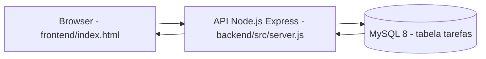

# Mini Manual do Projeto - API de Tarefas

## 1. Objetivo do projeto

Este projeto implementa uma API REST para gerenciamento de tarefas, com persistencia em MySQL e um frontend estatico para consumo da API.

Em termos simples:
- Backend: recebe requisicoes HTTP e manipula tarefas.
- Banco de dados: guarda as tarefas.
- Frontend: permite cadastrar, listar, concluir e excluir tarefas via navegador.
- Docker: facilita subir tudo com poucos comandos.
- GitHub Actions: valida a construcao em push e pull request.

---

## 2. Estrutura atual do repositorio

```txt
prj_api_tarefas_aula/
|- .github/
|  |- workflows/
|     |- ci.yml
|- backend/
|  |- src/
|     |- database.js
|     |- server.js
|     |- server.txt
|- frontend/
|  |- css/
|  |  |- style.css
|  |- js/
|  |  |- script.js
|  |- index.html
|- docs/
|  |- cronograma-final.md
|  |- cronograma1.md
|  |- resumoV1.md
|  |- rules.md
|  |- workflow.md
|- .dockerignore
|- .gitignore
|- docker-compose.yaml
|- Dockerfile
|- package-lock.json
|- package.json
|- README.md
```

---

## 3. Arquitetura geral (visao pratica)

Fluxo principal:
1. O usuario interage no frontend (HTML + JS).
2. O frontend chama a API em `http://localhost:3001/tarefas`.
3. O backend (Express) executa SQL no MySQL.
4. O backend devolve JSON para o frontend.



---

## 4. Backend (API) em detalhes

Arquivo principal: `backend/src/server.js`

### 4.1 Tecnologias usadas no backend
- Node.js
- Express
- mysql2
- cors

### 4.2 Configuracao base
- `express.json()` habilitado para receber JSON no body.
- `cors()` habilitado para permitir frontend e backend em origens diferentes.
- Porta fixa: `3001`.

### 4.3 Rotas implementadas

#### `GET /`
Retorna mensagem de status da API.

#### `GET /tarefas`
Lista todas as tarefas da tabela `tarefas`.

#### `GET /tarefas/:id`
Busca uma tarefa por ID.
- Retorna `404` se nao encontrar.

#### `POST /tarefas`
Cria tarefa com `titulo` e `descricao`.
- Validacao: `titulo` obrigatorio.
- `status` inicial gravado como `pendente`.

#### `PUT /tarefas/:id`
Atualiza toda a tarefa (`titulo`, `descricao`, `status`).
- Validacao: `titulo` obrigatorio.
- Retorna `404` se o ID nao existir.

#### `PATCH /tarefas/:id`
Atualizacao parcial.
- Aceita alteracao de `titulo`, `descricao` e/ou `status`.
- Retorna erro se nenhum campo vier no body.

#### `DELETE /tarefas/:id`
Remove a tarefa por ID.
- Retorna `404` se o ID nao existir.

### 4.4 Conexao com banco

Arquivo: `backend/src/database.js`

A conexao esta fixa com:
- host: `mysql`
- user: `root`
- password: `root`
- database: `prj_apitarefas`
- port: `3306`

Ponto importante:
- O host `mysql` funciona dentro da rede do Docker Compose.
- Fora do Docker (rodando Node local), o host normalmente deveria ser `localhost` (com porta `3307` quando usar o MySQL do compose).

---

## 5. Banco de dados (MySQL)

Banco esperado: `prj_apitarefas`

Tabela principal esperada pela API:

```sql
CREATE TABLE IF NOT EXISTS tarefas (
  id INT AUTO_INCREMENT PRIMARY KEY,
  titulo VARCHAR(255) NOT NULL,
  descricao TEXT,
  status VARCHAR(50) DEFAULT 'pendente'
);
```

Campos da tabela:
- `id`: identificador unico
- `titulo`: titulo da tarefa
- `descricao`: texto livre
- `status`: estado da tarefa (ex.: `pendente`, `concluida`)

---

## 6. Frontend (consumo da API)

Arquivos:
- `frontend/index.html`
- `frontend/js/script.js`
- `frontend/css/style.css`

O frontend:
- carrega tarefas ao abrir a pagina;
- envia nova tarefa por `POST`;
- alterna status por `PATCH`;
- remove por `DELETE`.

URL da API no frontend:
- `http://localhost:3001/tarefas`

Observacao:
- O frontend e simples, sem framework, usando `fetch` nativo do navegador.

---

## 7. Docker

### 7.1 Dockerfile

Resumo do que faz:
1. Usa imagem `node:20-alpine`.
2. Define `WORKDIR /app`.
3. Copia `package*.json`.
4. Roda `npm install`.
5. Copia o restante do projeto.
6. Expoe porta `3001`.
7. Comando final: `npm run dev`.

### 7.2 docker-compose.yaml

Servicos:

1. `api`
- build local via Dockerfile
- nome do container: `api-tarefas`
- porta: `3001:3001`
- depende do `mysql` saudavel (`healthcheck`)

2. `mysql`
- imagem: `mysql:8.0`
- nome do container: `mysql-api-tarefas`
- porta: `3307:3306`
- volume persistente: `mysql_data`
- variaveis:
  - `MYSQL_USER=apiuser`
  - `MYSQL_ROOT_PASSWORD=root`
  - `MYSQL_DATABASE=prj_apitarefas`

Volume:
- `mysql_data` persiste dados do banco entre reinicios.

### 7.3 Como subir com Docker

```bash
docker compose up --build
```

API em:
- `http://localhost:3001`

Parar:

```bash
docker compose down
```

---

## 8. Workflow de CI no GitHub (.github/workflows)

Arquivo: `.github/workflows/ci.yml`

### 8.1 Quando dispara
- `push` na branch `main`
- `pull_request` para `main`

### 8.2 O que o job faz
Job `build` (nome visivel: "Validar projeto") executa:
1. checkout do codigo (`actions/checkout@v4`)
2. setup Node 20 (`actions/setup-node@v4`)
3. `npm install`
4. `docker --version`
5. `docker compose build`

### 8.3 O que ele valida na pratica
- Se as dependencias Node instalam corretamente.
- Se a composicao Docker consegue construir as imagens.

### 8.4 O que ainda nao faz
- Nao executa testes automatizados.
- Nao executa lint.
- Nao executa deploy.

---

## 9. Scripts npm

Arquivo: `package.json`

Scripts atuais:
- `dev`: `nodemon backend/src/server.js`
- `start`: `node server.js`
- `test`: placeholder padrao (retorna erro)

Atencao:
- Como o backend principal esta em `backend/src/server.js`, o script `start` atual tende a falhar se executado como esta. O script mais alinhado ao projeto hoje e `npm run dev`.

---

## 10. Arquivo legado no backend

Existe um arquivo `backend/src/server.txt` com uma versao antiga/simples da API (em memoria, sem MySQL).

Ele nao e o servidor ativo do projeto atual.

---

## 11. Passo a passo rapido para rodar

### Opcao recomendada (Docker)
1. `docker compose up --build`
2. Garantir que tabela `tarefas` exista no banco.
3. Acessar `http://localhost:3001`.
4. Abrir `frontend/index.html` no navegador.

### Opcao local (sem API em container)
1. `npm install`
2. Subir apenas MySQL do compose (opcional): `docker compose up -d mysql`
3. Ajustar host/porta no `backend/src/database.js` se necessario.
4. `npm run dev`

---

## 12. Resumo final

O projeto contempla:
- API REST completa para CRUD de tarefas.
- Integracao com MySQL via mysql2.
- Frontend simples consumindo a API.
- Containerizacao com Docker e Compose.
- Pipeline de CI em GitHub Actions para validacao de build.

Em outras palavras, e um projeto didatico completo de backend com persistencia, integracao e fluxo basico de DevOps.